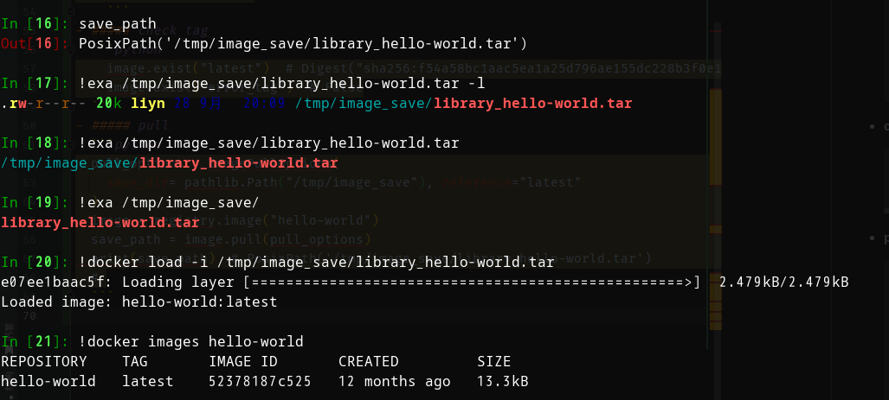

## undone...

based on [docker-registry-api](https://docs.docker.com/registry/spec/api/#detail)

#### TODO

- cli
- more image format
- stream transport
- ctx manager

### example

#### 1. create a client

```python
from registry_client.client import RegistryClient

client = RegistryClient()
```

#### 2. create a registry

```python
registry = client.registry(
    host="https://registry-1.docker.io", name="docker-registry"
)
```

#### registry

- ##### ping
    ```python
    ping_result = registry.ping()
    print(ping_result.json())
    # {'errors': [{'code': 'UNAUTHORIZED',
    #   'message': 'authentication required',
    #   'detail': None}]}
    ```

#### image

```python
image = registry.image("library/hello-world")
```

- ##### list tags

    ```python
    tags = image.get_tags()
    print(tags)
    # ['latest',
    # 'linux',
    # 'nanoserver',
    # 'nanoserver-1709',
    # 'nanoserver-1803',
    # 'nanoserver-1809',
    # 'nanoserver-ltsc2022',
    # 'nanoserver-sac2016',
    # 'nanoserver1709']
    ```
- ##### check tag
  ```python
    image.exist("latest")  # Digest("sha256:f54a58bc1aac5ea1a25d796ae155dc228b3f0e11d046ae276b39c4bf2f13d8c4")
    image.exist("error_tag")  # False
  ```
- ##### pull
  ```python
  pull_options = ImagePullOptions(
    save_dir= pathlib.Path("/tmp/image_save"), reference="latest"
  )
  image = registry.image("hello-world")
  save_path = image.pull(pull_options)
  print(save_path)  # PosixPath('/tmp/image_save/library_hello-world.tar')
  # 
  ```
  