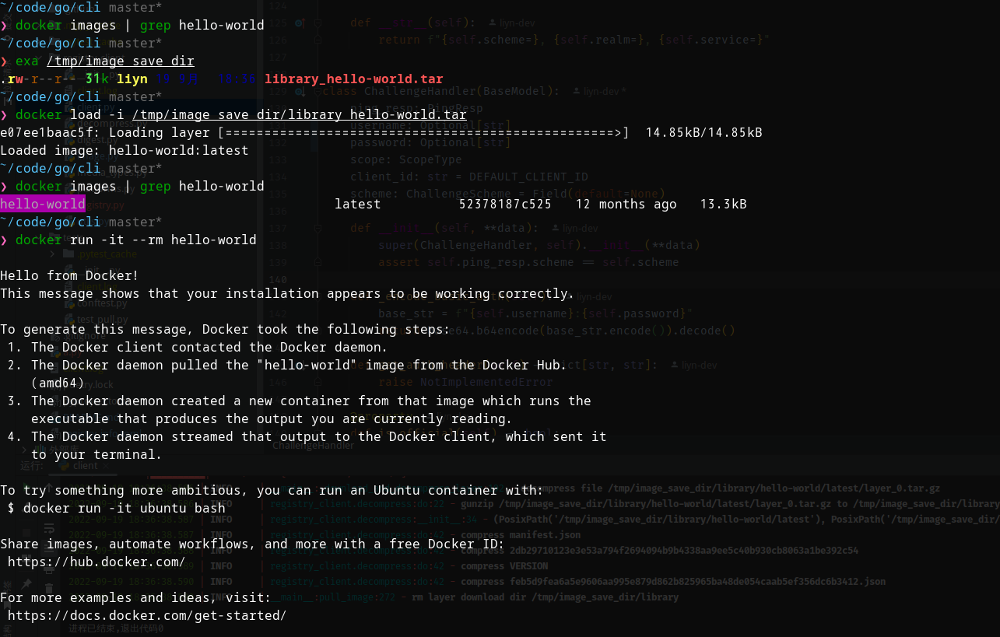

## undone...

based on [docker-registry-api](https://docs.docker.com/registry/spec/api/#detail)

### example

#### pull docker-hub image

```python
import pathlib
from registry_client.client import ImageClient

client = ImageClient(host="registry-1.docker.io")
client.pull_image(image_name="hello-world",
                  repo_name="library", reference="latest",
                  save_dir=pathlib.Path("/tmp/image_save_dir"))
```



#### pull docker registry mirror image

```python
from registry_client.client import ImageClient

client = ImageClient(host="hub-mirror.c.163.com",
                     scheme="http")
client.pull_image(image_name="hello-world",
                  repo_name="library", reference="latest")
```

#### pull harbor registry image

```python
from registry_client.client import ImageClient

harbor_ip = "127.0.0.1:8081"
harbor_username = "admin"
harbor_password = "Harbor12345"

client = ImageClient(host=harbor_ip, username=harbor_username,
                     password=harbor_password, scheme="https")
client.pull_image(image_name="hello-world",
                  repo_name="library", reference="latest")
```